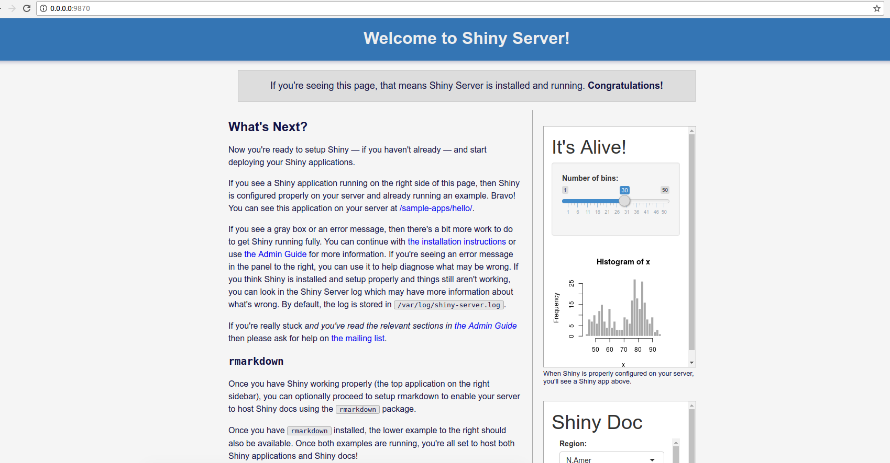
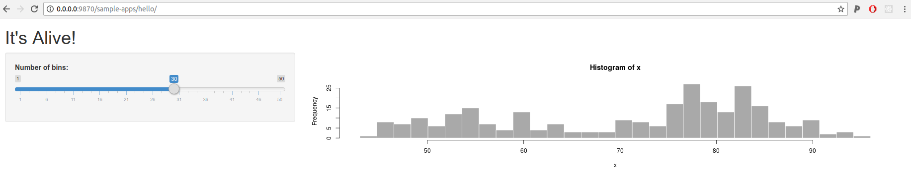

# Singularity Shiny
Singularity Image to run a local shiny server.

## Build
Use the makefile

```
make
```

or build on your own:

```
sudo singularity build shiny.simg Singularity
```

## Generate Configuration
You will first generate a custom configuration for your user, and it will
give you instructions for usage:

```
$ /bin/bash prepare_template.sh

Steps:
          ----------------------------------------------------------------------
          1. Use this script to prepare your shiny-server.conf (configuration)
 
               /bin/bash prepare_template.sh

          ----------------------------------------------------------------------
          2. If needed, you can provide the following arguments

          Commands:
             help: show help and exit
             start: the generation of your config

          Options:  
           --port:  the port for the application (e.g., shiny default is 3737)
           --base: base folder with applications
           --logs: temporary folder with write for logs (not required)
           --disable-index: disable directory indexing

          ----------------------------------------------------------------------
          3. Make sure Singularity is loaded, and run the container using 
             the commands shown by the template.

```
When you add `start` it will do the generation. Here we don't supply any arguments
so that they are randomly generated.

```
$ /bin/bash prepare_template.sh start
Generating shiny configuration...
port: 9870
logs: /tmp/shiny-server.gG1X2Z
base: /srv/shiny-server
Server logging will be in /tmp/shiny-server.gG1X2Z

To run your server:

    module load singularity/2.4.6
    singularity run --bind /tmp/shiny-server.gG1X2Z/logs:/var/log/shiny \
    --bind /tmp/shiny-server.gG1X2Z/lib:/var/lib/shiny-server \
    --bind shiny-server.conf:/etc/shiny-server/shiny-server.conf shiny.simg

    ---------------------------------------------------------------------------
    For custom applications, also add --bind /srv/shiny-server:/srv/shiny-server
    To see your applications, open your browser to http://127.0.0.1:9870 or
    open a ssh connection from your computer to your cluster.

```

The configuration is generated in your present working directory:

```
$ cat shiny-server.conf
run_as docker;
server {
  listen 9098;

  # Define a location at the base URL
  location / {

    # Host the directory of Shiny Apps stored in this directory
    site_dir /srv/shiny-server;

    # Log all Shiny output to files in this directory
    log_dir /tmp/shiny-server.PtVRXE;

    # When a user visits the base URL rather than a particular application,
    # an index of the applications available in this directory will be shown.
    directory_index on;
  }
}
```

## Start Server
Once you have that template, follow the instructions to run the container. The
temporary folder is already created for you.

```
    singularity run --bind /tmp/shiny-server.gG1X2Z/logs:/var/log/shiny \
    --bind /tmp/shiny-server.gG1X2Z/lib:/var/lib/shiny-server \
    --bind shiny-server.conf:/etc/shiny-server/shiny-server.conf shiny.simg
[2018-04-07T00:14:17.403] [INFO] shiny-server - Shiny Server v1.5.7.890 (Node.js v8.10.0)
[2018-04-07T00:14:17.405] [INFO] shiny-server - Using config file "/etc/shiny-server/shiny-server.conf"
[2018-04-07T00:14:17.456] [INFO] shiny-server - Starting listener on 0.0.0.0:9870
```

## Interface
When you open your browser to the port instructed, you will see the root of shiny!



You can check out the sample apps:



You can press Control+C to exit the server and stop the container. Be careful with running
Shiny with Singularity - if you lose connection to the container and the server is
running, it will remain as a ghost process. When Singularity has the ability for
the start script to take arguments, we will be able to run it as an instance
(but not yet).

## Customization
If you shell inside and look under /srv/shiny-server, you will see all the default
(sample) apps!

```
singularity shell shiny.simg
$ ls /src/shiny-server
ls /srv/shiny-server/
01_hello  03_reactivity  05_sliders  07_widgets  09_upload    11_timer	  sample-apps
02_text   04_mpg	 06_tabsets  08_html	 10_download  index.html
```
This means that when you run the container, if you add a bind to a folder of your own apps
here, you can add your custom applications. The bind would look something like:

```
--bind /path/to/apps/folder:/srv/shiny-server
```

You can also choose to disable the indexing, meaning that someone that navigates to
the root of the server (at the port) won't be able to explore all of your apps.

```
$ /bin/bash prepare_template.sh --disable-index
```

You can also customize the port, temporary folder, and base (if somewhere other than
/srv/shiny-server). Have fun!
